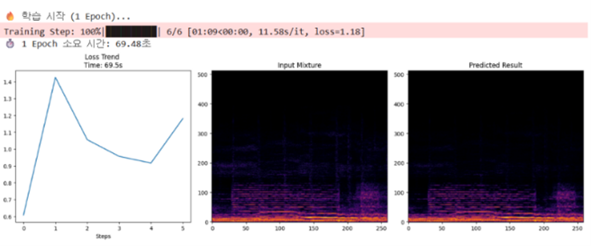
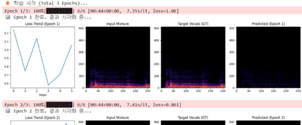
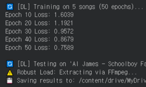
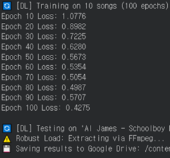
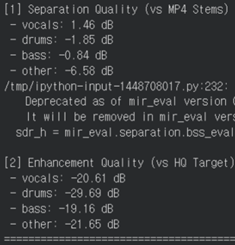
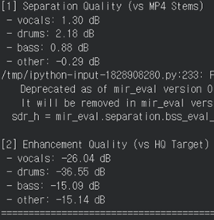
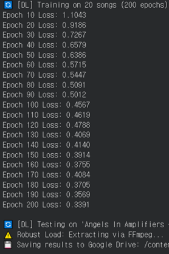
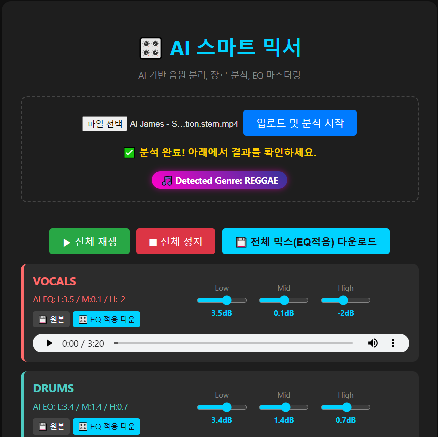

# MUSDB18 dataset을 이용한 음원 분리 모델 구현

## Members
- 김모연, 융합전자공학부 4학년
- 박현우, 컴퓨터소프트웨어학부 3학년
- 서지민, 융합전자공학부 3학년
- 이중원, 융합전자공학부 3학년

---

## I. Proposal (Motivation & Goal)
‘칵테일 파티 효과’로 불리는 인간의 청각적 선택 집중 능력은 오랫동안 컴퓨터로 구현하기 어려운 난제였습니다. 이를 구현하기 위한 초기 규칙기반(Rule-based) 알고리즘은 불규칙한 실제 음향 신호를 처리하는 데 한계가 있었으나, DNN(Deep Neural Networks)의 등장으로 음원 분리 기술은 혁명적인 발전을 맞이했습니다.
저희는 이러한 딥러닝 기술을 활용하여, 혼합된 오디오 신호 속에서 보컬과 특정 악기를 정교하게 분리해내는 시스템을 직접 구현하고 그 과정을 탐구하고자 합니다.

## II. 데이터셋 및 환경

### 1. 데이터셋(Datasets)
본 프로젝트는 음악 음원 분리 분야의 표준 벤치마크인 MUSDB18에서 파생된 MUSDB18-hq 데이터셋을 기반으로 실험이 수행되었습니다.

### 2. 데이터 구성
효율적인 학습과 테스트를 위해 데이터는 다음과 같이 구성 및 전처리되었습니다.
학습 데이터 (Train):
input: Google Drive train_hq 폴더 내의 wav 음원 사용.
학습 방식: mixture(혼합 음원) 입력, vocals, drums, bass, other의 4개 source로 분리 학습
테스트 데이터 (Test):
input: test_mp4 폴더 내의 mp4 포맷 mixture 음원 (모델이 처음 보는 곡).
전처리: 메모리 및 연산 효율을 위해 음원에서 30초만 chunking(30 Sec Cut)하여 데이터셋 구성, 리소스 한계를 극복하기 위한 첫 번째 전략적 선택.
### 3. 환경 (Environment)
	플랫폼: Google Colab (NVIDIA T4 GPU 런타임)
	언어: python (주요 라이브러리: PyTorch, Demucs, Conv-TasNet 등)

## III. 시행착오(Trial and Error) 및 분석
본 프로젝트는 직접 모델을 훈련하는 방식이 자원 한계로 인해 어렵다고 판단하고, 사전 학습된 모델(Pre-trained Model) 활용을 통한 애플리케이션 구현으로 전략을 수정했습니다. 초기 시도와 실패 분석은 다음과 같습니다.

### 1. 경량화 U-Net 토이 모델 검증 및 최적화 시도
직접 학습의 가능성을 검증하기 위해, 연산 복잡도가 낮은 CNN 기반 U-Net 토이 모델을 사용하여 학습 파이프라인의 유효성과 자원 한계를 확인했습니다.
아키텍처: CNN 기반 U-Net Toy Model (경량화 모델)
source: MUSDB18 표준 데이터셋
전략: 긴 음원 3초 Random Chunk로 샘플링, 전곡 학습 후 시간 측정

초기 문제점 (MP4 사용 시): MUSDB18 표준 데이터셋의 MP4 포맷 사용 시, CPU bottleneck 현상(1 epoch에 약 70초 소요), Loss 발산 현상 발생
전처리 및 최적화 시도: WAV 사전 디코딩 적용, 학습에 MP4 파일이 아닌 MUSDB18-hq의 WAV 포맷을 사용하도록 전환하여 mp4 포맷의 압축 디코딩을 전처리 단계에 함으로써 I/O 효율을 개선했습니다. (1 epoch 당 44초로 약 1.6배 단축)
전략 수정: 초기 3초 random chunk 샘플링의 경우 음원의 context를 잃어 loss 발산 확률이 늘어남을 확인했습니다. 이에 유의미한 성능을 위해 30초 구간의 데이터를 활용하는 방향으로 수정했습니다.

### 2. 데이터 스케일링 및 성능 정량 평가

학습 1차 – 음원 5곡 + 50epoch

결과 : 초기 모델 구동 확인. 데이터 부족으로 분리 성능 미흡.

학습 2차 – 음원 10곡 + 100epoch

결과 : Loss 감소 확인, 학습 진전 확인.

 
학습 3차 – 학습 음원 20곡 + 200epoch

결과 : 최종 Loss가 0.3대까지 안정적으로 수렴, 학습 유효성 입증 (총 46분 소요)

#### 📊 평가 지표 분석: SDR (Signal-to-Distortion Ratio)
SDR은 분리된 음원이 정답 음원과 얼마나 유사한지를 나타내는 수치(단위: dB)로, 양수 dB는 분리에 성공했음을 의미합니다. (높을수록 좋음)
0 dB = (분리된 소리 = 잡음 크기) : 분리 실패 
음수 dB = (잡음이 더 큼) : 분리 실패 
양수 dB = (분리된 소리가 더 큼) : 분리 성공 시작 
5~10 dB 이상 = (상용 수준의 깔끔한 분리) : Spleeter 등 최신 AI

| 분리된 소스 | SDR (dB) | 분석 |
| :--- | :--- | :--- |
| **Drums** | **+2.18 dB** | [cite_start]악기의 가장 뚜렷한 주파수 특성으로 가장 잘 분리됨. [cite: 124] |
| **Vocals** | **+1.30 dB** | [cite_start]사람의 목소리와 악기를 어느 정도 구분하는 데 성공. [cite: 124] |
| **Bass** | **+0.88 dB** | 초기 음수에서 데이터 증량 후 양수로 전환. [cite_start]저음역대 구분 능력 확보 중. [cite: 124] |
| **Other** | **-0.29 dB** | 0dB에 근접. [cite_start]여전히 음수이나 초기(-7dB) 대비 소스의 형체를 알아볼 수 있는 수준. [cite: 124] |

### 3. SOTA 모델 자원 효율성 검증 (실패 분석)
[cite_start]U-Net 토이 모델의 한계를 확인한 후 SOTA 모델 학습을 시도했으나, 다음과 같은 자원 한계에 봉착했습니다. [cite: 127]

| 모델 | 시도 결과 | 분석 |
| :--- | :--- | :--- |
| **Demucs v4** | 학습 시작 실패 | [cite_start]**VRAM 한계**로 인한 OOM 발생 [cite: 128] |
| **Demucs v2** | 학습 중단 | [cite_start]1 Epoch 학습 중 **Colab 런타임(12시간) 초과** [cite: 128] |
| **Conv-TasNet** | 비효율성 확인 | [cite_start]유의미한 성능(100 epoch) 위해 수백~수천 시간 소요 예상 [cite: 128] |

### 4. 분석 종합: 왜 직접 학습이 어려운가?
저희는 위의 시행착오 분석을 통해, 음원 분리(Source Separation) 분야가 가지는 근본적인 어려움과 프로젝트의 자원 제약 간의 충돌을 확인했습니다. 이에 대한 이론적 고찰입니다.
#### 1. 칵테일 파티 효과와 비선형 혼합 (Non-linear Mixing)
	음향 신호는 단순 합을 넘어 잔향, 위상 변이 등 복잡한 비선형적 상호작용을 일으킵니다.
	DNN은 이 복잡성을 모델링하지만, 이를 위해 극도로 깊고 거대한 네트워크가 요구됩니다.
상용 모델의 경우 대게 수백만~수억 개 이상의 파라미터를 지닙니다.

#### 2. 고차원 데이터와 연산 복잡성
음악 데이터는 다른 데이터 형태에 비해 차원이 매우 높습니다.
	음악 데이터는 초당 수만 개의 샘플로 이루어지며, 시간-주파수 도메인(Spectrogram)으로 변환 시 데이터 크기가 더욱 커집니다.
	Demucs나 Conv-TasNet과 같은 SOTA 모델의 수많은 Convolutional/Recurrent Layers는 시간적/주파수적 문맥 파악에 필수적이지만, 필연적으로 막대한 연산량(FLOPs)과 VRAM을 요구합니다.

#### 3. 데이터셋 규모의 필요성(일반화 성능 확보)
	실전에서 작동하려면 다양한 장르와 음색을 학습해야 하므로, 상용 모델은 최소 수만 곡 이상의 대규모 데이터가 필요합니다.
	결론: 학부 프로젝트의 제한된 자원과 시간제한(Colab Free Tier)으로는 SOTA 모델의 학습은 물론, 유의미한 일반화 성능을 기대하기 어렵습니다.

## IV. Future Plan – 프로젝트의 전략 수정
현재까지의 시행착오 분석을 바탕으로, 저희는 프로젝트의 핵심을 '모델 학습 및 검증'에서 '모델 활용 및 결과, 그리고 그 과정의 심층 분석'으로 전환할 예정입니다..

### 1. Pre-trained 모델 선정 및 활용
	모델 선정: Spleeter 또는 Demucs, conv-tasnet와 같이 검증된 사전 학습된 모델을 선정합니다.
	활용: 해당 모델을 MUSDB18 데이터셋의 Test Set 및 직접 선정한 음악에 적용하여 음원 분리를 수행합니다.
### 2. 정량적/정성적 분석 강화 (Evaluation & Analysis)
	정량적 평가: Pre-trained 모델의 SDR, SIR(Signal-to-Interference Ratio) 등의 지표를 활용하여 분리 성능을 측정하고, 저희의 토이 모델의 결과와 비교 분석합니다.
	정성적 평가: 분리된 소스를 직접 청취하여 노이즈, 간섭 수준 등을 평가하고, 시각화(Spectrogram) 자료를 통해 주파수 도메인에서의 분리 결과 차이를 분석합니다.
### 3. 애플리케이션 구현 및 시연 (Demo)
	Demo 구현: Pre-trained 모델을 활용하여 사용자가 직접 음원을 업로드하고 분리 결과를 청취/다운로드할 수 있는 웹 데모를 구현합니다.
	Video Recording: 구현한 데모 시연 및 분석 결과를 포함한 5-10분 분량의 영상을 제작합니다.

 
### 4. 추가 기능
단순 음원 분리에서 머무르지 않고, 피치 조절이나 분리된 음원(예: 보컬, 베이스)을 활용하여 auto eq(equalizer) 설정 등 청취 경험을 향상시키는 후처리 딥러닝 모델의 도입을 가능한 선에서 추가 검토 및 구현합니다.
