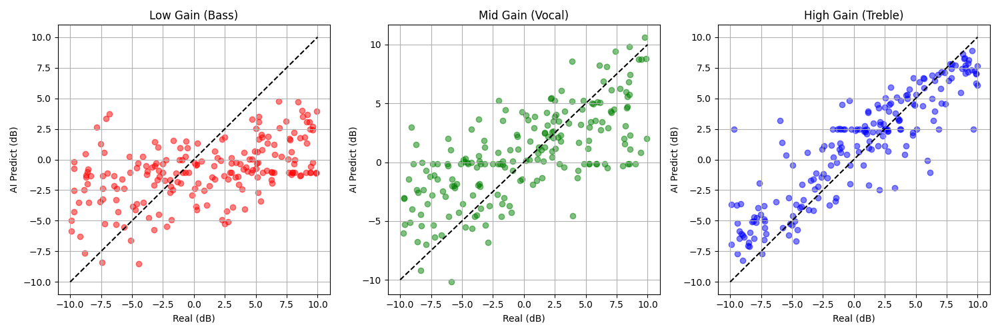
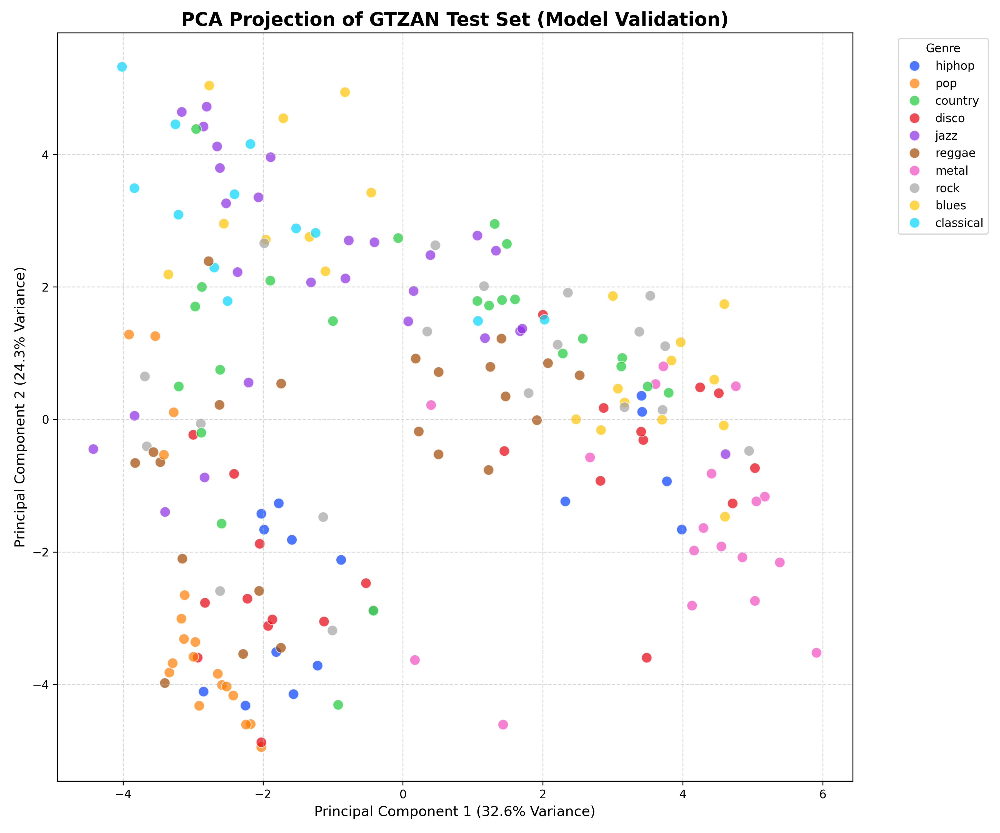
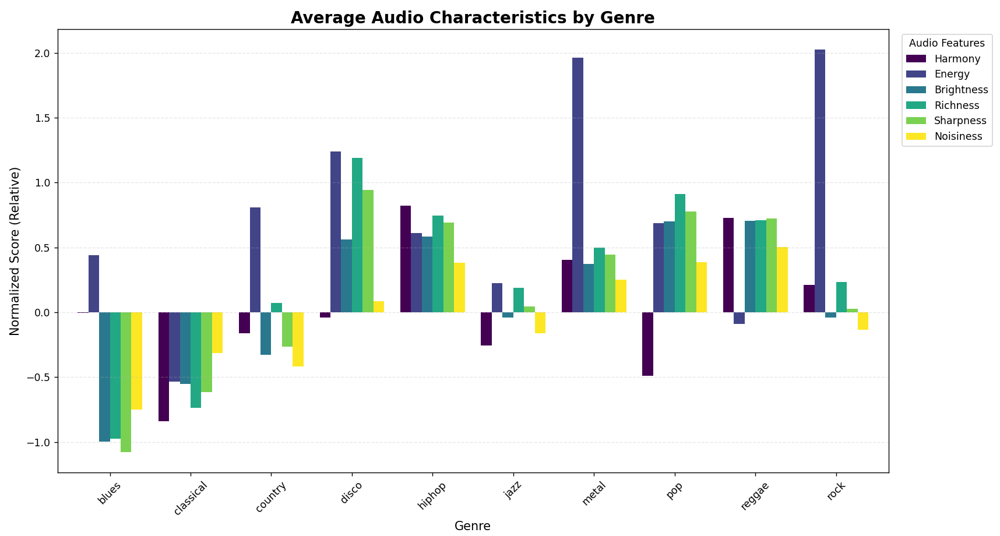
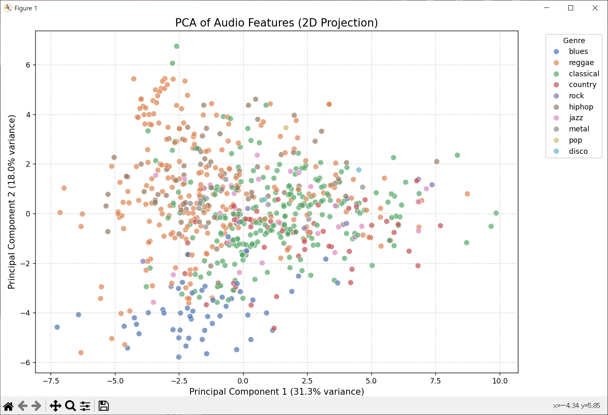

# MUSDB18 dataset을 이용한 음원 분리 모델 구현

## Members
- 이중원, 2021080364 융합전자공학부
- 서지민, 2023004611 융합전자공학부
- 김모연, 2021068895 융합전자공학부
- 박현우, 2021027329 컴퓨터소프트웨어학부

---

## I. Introduction
여러 소리 중 특정 소리에만 선택적으로 집중하는 인간의 청각 능력, 일명 '칵테일 파티 효과(Cocktail Party Effect)'를 컴퓨터로 구현하는 것은 오랫동안 난제로 남아 있었습니다. 초기의 규칙 기반(Rule-based) 알고리즘들은 예측 불가능한 실제 오디오 신호의 특성을 제대로 처리하지 못했으나, 최근 심층 신경망(DNN)의 발전과 함께 소스 분리(Source Separation) 기술은 비약적으로 도약했습니다.

본 프로젝트는 이러한 딥러닝 기술을 활용하여, 혼합된 오디오 신호(Mixture)에서 보컬과 특정 악기를 정밀하게 분리하는 시스템을 구현하고 그 과정을 탐구하는 것을 목표로 합니다.

이 프로젝트는 Logic Pro의 'Stem Splitter'와 Deezer의 'Spleeter'와 같은 상용 도구에서 영감을 받았습니다. 저희 팀은 당초 최신 고성능 모델인 Demucs의 직접 학습을 고려했으나, 학생 수준의 하드웨어 환경에서 Demucs는 1 Epoch 학습에만 약 20시간이 소요되는 등 막대한 연산 비용이 발생하여 현실적인 운용이 불가능함을 확인했습니다.

이에 대한 대안으로 저희는 Time-domain(시간 영역)에서 직접 연산을 수행하여 연산 효율이 뛰어난 Conv-TasNet에 주목했습니다. 실험 결과, Conv-TasNet은 단 1 Epoch의 학습만으로도 유의미한 분리 성능을 보여주었으며, 이에 저희 팀은 Conv-TasNet을 최종 프로젝트의 핵심 분리 엔진으로 채택하였습니다.

따라서 본 프로젝트의 최종 목표는 제한된 컴퓨팅 리소스 내에서 효율적인 모델(Conv-TasNet)을 학습시키고, 이를 커스텀 EQ 및 장르 분류 모델과 결합하여 상용 소프트웨어와 유사한 경험을 제공하는 자체 웹 인터페이스를 구현하는 것입니다.

<br/>
<br/>

## II. Dataset and Environment

### A. Problem Context

음악은 서로 다른 소스에서 나온 여러 스템(Stem)이 겹쳐져 하나의 조화로운 파형을 형성합니다. 인간은 청각으로 이를 쉽게 구분하지만, 컴퓨터 입장에서는 섞여 있는 하나의 입력 신호일 뿐입니다. 이를 분리하기 위해서는 비선형적인 혼합 과정, 고차원 오디오 데이터 처리, 그리고 긴 시간적 의존성(Temporal Dependency)을 모델링해야 합니다. 이러한 시스템을 처음부터 학습시키는 것은 매우 높은 계산 비용을 요구합니다.

<br/>

### B. Datasets

#### 1. MUSDB18-HQ

Source: [SigSep](https://zenodo.org/records/3338373) (22.7 GB)

Spec: 44.1 kHz, stereo	

Structure: 곡당 5개 트랙 (mixture, vocals, drums, bass, others)

Split: Training (100곡), Testing (50곡)

Usage:

-	소스 분리 모델(Conv-TasNet) 학습 및 평가

-	Auto-EQ 학습을 위한 입력 데이터 생성 (임의로 음질을 저하시킨 데이터 생성)

-	장르 프로파일링

#### 2. GTZAN Genre Collection

Source: [Kaggle](https://www.kaggle.com/datasets/andradaolteanu/gtzan-dataset-music-genre-classification) (1.41 GB)

Spec: 22.05 kHz, Mono, 30초 길이

Structure: 10개 장르 × 100곡 (총 1,000곡)

Usage:

-	GenreNet(장르 분류기) 학습

-	MUSDB18-HQ 데이터셋의 장르 분포 분석(Cross-dataset profiling)

<br/>
<br/>

## III. Methodology
저희 시스템의 핵심 분리 백엔드는 Conv-TasNet입니다. 초기에는 파형 기반의 SOTA 모델인 Demucs 학습을 시도했으나 리소스 한계로 중단하였고, 대신 Time-domain Convolution을 활용하여 적은 학습량으로도 효율적인 성능을 내는 Conv-TasNet을 최종 모델로 선정하여 구현했습니다. 여기에 직접 설계한 Auto-EQ(Custom CNN)와 GenreNet(Custom DNN)을 결합하였습니다.

### A. Music Source Separation – Conv-TasNet
처음 시도했던 Demucs(양방향 LSTM 및 인코더-디코더 구조)는 성능은 뛰어나지만 학습 속도가 매우 느렸습니다. Colab GPU 환경 기준 1 Epoch에 약 20시간이 소요되었으며 Loss 수렴이 되지 않았습니다. 반면, Conv-TasNet은 마스킹 기반의 Time-domain 분리 방식을 사용하여 연산 효율성이 뛰어났습니다. 테스트 결과, 단 1 Epoch 학습만으로도 준수한 SDR(신호 대 잡음비)을 확보할 수 있어 이를 채택했습니다.

#### 1. Input and Encoding

원본 오디오(mixture.wav)를 1D Convolutional Encoder에 통과시켜 고차원 잠재 표현(Latent Representation, mixture_w)으로 변환합니다.
- Kernel Size: 20
- Stride: 10

#### 2. Separator Module (Core)

시스템의 핵심으로, 1D Convolution과 ReLU 활성화 함수 스택을 사용합니다.

특히, 기하급수적으로 증가하는 Dilation Factors를 적용하여 Temporal Receptive Field를 확장합니다. 이를 통해 짧은 Transients (예: 드럼 타격)부터 긴 Musical Phrasing까지 모두 학습할 수 있습니다.
- Kernel Size (P): 3
- Stride: 1
- Dilation: 2⁰, 2¹, … , 2⁷

#### 3. Masking and Decoding
   
모델은 잠재 표현(mixture_w)과 추정된 마스크(est_mask)를 요소별 곱(Element-wise Multiplication)으로 결합합니다. 이후 Decoder를 통해 다시 시간 도메인 파형으로 변환하여 최종 분리된 오디오(est_source)를 생성합니다.

mixture_w ⊙ est_mask → est_source_features

#### 4. Training Setup
   
Target: 4 Stems (Vocals, Drums, Bass, Other)

Loss Function: L1 Loss (MAE) / Optimizer: Adam

Training Strategy: 단 1 Epoch 학습

(Reasoning: 하드웨어 제약으로 인해 장시간 학습이 불가능했으나, Conv-TasNet은 1 Epoch만으로도 초기 Demucs 시도보다 나은 분리 성능과 압도적인 속도를 보여주어 추가 학습 없이 채택했습니다.)

<br/>

### B. Auto Equalizer – 오디오 기반 보정 EQ 예측

분리된 Stem의 음질을 자동으로 보정하기 위해, 오디오 클립의 저음(Low), 중음(Mid), 고음(High) gain값을 예측하는 경량화된 Custom CNN 모델을 구축했습니다.

#### 1. Data Preparation

깨끗한 원본 Stem(예: vocals.wav)에 임의의 손상을 가해 학습 데이터를 생성합니다. Low(100Hz), Mid(1kHz), High(10kHz) 대역에 -10dB ~ +10dB 사이의 랜덤 게인을 적용하여 '손상된 오디오'를 만들고, 모델은 이 손상의 역값(Inverse)을 예측하도록 학습됩니다.

#### 2. Mel Spectrogram Conversion
   
오디오를 인간의 청각 특성과 유사한 Mel Spectrogram으로 변환하여 모델의 입력(Input Image)으로 사용합니다. (64 frequency bins)

#### 3. CNN Architecture
   
3개의 Convolution Layer (채널 수: 16 → 32 → 64)

각 층마다 ReLU 활성화 함수와 Max Pooling 적용

마지막에 Adaptive Average Pooling을 거쳐 특징맵을 압축

#### 4. Prediction
   
Flatten 후 2개의 Linear Layer를 거쳐 최종적으로 3개의 값(Low, Mid, High EQ Gain)을 출력합니다.

Performance: 평균 예측 오차(MAE) 약 3.32dB 달성.

<br/>

### C. Genre Classification – Lightweight Audio GenreNet

MUSDB18-HQ 데이터셋의 메타데이터를 보강하고 분석하기 위해, GTZAN 데이터셋으로 학습된 Custom Keras DNN 분류기를 구축했습니다.

#### 1. Feature Extraction (Librosa)

각 오디오에서 26차원 특징 벡터를 추출합니다.

Features: Chromagram, Spectral Centroid/Bandwidth/Rolloff, RMS Energy, ZCR, MFCCs (1-20)

#### 2. Neural Network Architecture

Structure: Fully Connected Dense Layers (512 → 256 → 128 → 64 → 10 Output)

Tech Spec: ReLU Activation, Dropout (0.2), Adam Optimizer, Sparse Categorical Crossentropy

단순한 구조임에도 데이터셋 프로파일링과 분류 작업에 충분한 성능을 보였습니다.

<br/>

### D. Dataset Profiling

MUSDB18-HQ에는 장르 레이블이 없으므로, 위에서 만든 GenreNet을 사용하여 Pseudo-labeling(가짜 라벨링)을 수행했습니다. 분석 결과, 해당 데이터셋은 클래식(Classical)과 레게(Reggae) 트랙 비중이 높았으며, 락/메탈 장르는 높은 에너지 지표를 보였습니다. 이는 분리 모델의 성능 편향(Bias)을 이해하는 중요한 단서가 되었습니다.

<br/>
<br/>

## IV. Evaluation & Analysis 

### A. Source Separation Evaluation (Conv-TasNet)
   
#### Training Loss (MAE)

Epoch 1: 하드웨어 한계로 인해 1 에포크만 가능했습니다.

- Train: 0.1561 (약 15.6% 오차)
- Validation: 0.2354 (약 23.5% 오차)
- Duration: ~20 hours

#### Test Metrics (SDR, SIR, SAR, ISR)

$$\hat{s} = s_{\text{target}} + e_{\text{interf}} + e_{\text{artif}} + e_{\text{spat}}$$

* **$s_{\text{target}}$**: The portion of the signal that matches the ground-truth source
* **$e_{\text{interf}}$**: The portion that overlaps with other (non-target) instruments
* **$e_{\text{artif}}$**: Artificial noise components created by the AI model
* **$e_{\text{spat}}$**: Components representing spatial distortion

$$
\begin{aligned}
\text{SDR (Source-to-Distortion)} &= 10 \log_{10} \frac{\| s_{\text{target}} \|^2}{\| e_{\text{interf}} + e_{\text{artif}} \|^2} \\
\text{SIR (Source-to-Interference)} &= 10 \log_{10} \frac{\| s_{\text{target}} \|^2}{\| e_{\text{interf}} \|^2} \\
\text{SAR (Sources-to-Artifacts)} &= 10 \log_{10} \frac{\| s_{\text{target}} + e_{\text{interf}} \|^2}{\| e_{\text{artif}} \|^2} \\
\text{ISR (Image-to-Spatial)} &= 10 \log_{10} \frac{\| \hat{s} - e_{\text{spat}} \|^2}{\| e_{\text{spat}} \|^2}
\end{aligned}
$$

<div align="center">
 
| Stem | SDR (dB) | SIR (dB) | SAR (dB) | ISR (dB) |
| :--- | :--- | :--- | :--- | :--- |
| **Bass** | **+2.80 dB** | **+7.78 dB** | **+1.35 dB** | **+3.94 dB** |
| **Drums** | **+3.21 dB** | **+4.56 dB** | **+1.91 dB** | **+7.29 dB** |
| **Other** | **+1.71 dB** | **-0.88 dB** | **+3.21 dB** | **+3.67 dB** |
| **Vocals** | **+2.30 dB** | **+3.56 dB** | **+1.73 dB** | **+6.03 dB** |

</div>

<div align="right">
(higher is better)
</div>

<br/>
처음에 시도한 모델인 Demucs(v2)의 평균 SDR이 +6.3 dB인 것과 비교했을 때 부족한 성능이긴 하지만, 가벼운 모델인 Conv-Tasnet을 사용했다는 점, 첫번째 epoch으로 얻은 모델이라는 점을 고려하면 의미있는 수준으로 음원을 분리할 수 있다는 것을 확인할 수 있습니다.

<br/>

### B. Auto Equalizer

#### Training Loss (MSE)
<div align="center">
  
</div>

Training loss가 수렴하는 것을 확인할 수 있습니다.
<br/>
#### Test Metrics (MAE)
<div align="center">
  
</div>
 
Average error: 3.3187 dB

low frequency 대역에서는 비교적 부정확한 예측을 보여주지만, 전반적으로 사용자에게 유효한 EQ 프리셋을 추천할 수 있음을 확인할 수 있습니다.

<br/>

### C. 장르 분류 성능 (Genre Classification Performance)
   
#### 1. 모델 검증 (GTZAN Testset)

<div align="center">
  
</div>

Method: PCA (Principal Component Analysis)

Result: 26-dimensional feature을 2D로 projecting했을 때, 클래식(Classical)이나 메탈(Metal)과 같이 강력한 음향적 정체성을 가진 장르들이 명확하게 군집화(Clustering)되는 것을 관찰했습니다.

#### 2. MUSDB18-HQ 프로파일링 결과 (확장 분석)

**< Genre Distribution >**

<div align="center">
  
</div>

Analysis: GTZAN 기반 모델을 사용하여 MUSDB18-HQ를 분석한 결과, 데이터셋이 Classical과Reggae 트랙 위주로 구성되어 있음을 확인했습니다.

Implication: 이는 소스 분리 모델이 이러한 장르의 전형적인 주파수 특성에 편향되었을 가능성을 시사합니다.

**< Average Feature Analysis >**

<div align="center">
  
</div>

Objective: 장르별 평균 음향 특징을 비교하여 데이터셋의 특성을 분석합니다. 

Analysis: 메탈과 락 트랙은 다른 장르에 비해 상대적으로 높은 에너지 값을 보였습니다.

**< Feature Space Visualization >**

<div align="center">
  
</div>

Method: PCA projection on MUSDB18-HQ

Result: 시각화 결과, 데이터셋이 단일 클러스터에 국한되지 않고 광범위한 음향 특징 공간(스펙트럼 공간)을 포괄하고 있음을 보여줍니다.

<br/>

### C. 시스템 구현 결과 (System Implementation Result)

**< Web Interface >**

<div align="center">
  
</div>

Functionality: 

- Drag & Drop 업로드, Multi-track Sliders (Volume/EQ), Genre Badge
- 실시간 기능: Latency-free Mixing & Instant WAV Export (Full Mix / Stems)
- Visualization: 입력 오디오의 특징(BPM, 에너지 등)을 정량적 차트로 표시합니다.

<br/>
<br/>

## V. Related Work

본 프로젝트는 최신 오디오 신호 처리 및 머신러닝 분야의 선행 연구들을 이론적 배경으로 합니다. 기존의 검증된 모델, 데이터셋, 그리고 분석 도구들은 본 연구의 기술적 타당성을 확보하고 독자적인 파이프라인을 구축하는 데 중요한 토대가 되었습니다.

1. Demucs: Meta AI가 개발한 Demucs는 현재 가장 뛰어난 성능을 보이는 파형 기반 분리 모델 중 하나입니다. 그러나 모델 구동과 학습에 막대한 연산 자원이 요구된다는 한계가 있습니다. 저희는 초기 연구 단계에서 Demucs를 비교군으로 분석하였으며, 이를 통해 제한된 하드웨어 환경에서는 연산 효율성이 높은 모델이 필수적임을 확인하였습니다. 이는 결과적으로 Conv-TasNet을 선택하게 된 역설적인 계기가 되었습니다.
   
2. Conv-TasNet: Time-domain(시간 영역) 분리의 유효성을 입증한 모델입니다. 주파수 변환(STFT)에 의존하지 않고, Dilated Convolution(팽창된 합성곱)을 활용하여 미세한 리듬감부터 긴 시간적 패턴까지 효과적으로 포착합니다. 본 프로젝트는 하드웨어 제약 상황에서 이 모델이 가진 경량성과 연산 효율성에 주목하여, 이를 핵심 분리 엔진으로 채택하고 직접 학습을 수행했습니다.
   
3. GTZAN Genre Classification연구: 대부분의 장르 분류 선행 연구들은 MFCC, Spectral Descriptors, Chroma와 같은 음향 특징 세트의 유효성을 검증해 왔습니다. 본 프로젝트의 Custom Keras 장르 분류기 또한 이러한 연구 결과를 바탕으로 26차원 특징 벡터를 구성하였습니다. 선행 연구들은 적절한 특징 추출이 선행될 경우, 비교적 단순한 완전 연결 네트워크(Fully Connected Network)로도 장르 분류 작업에서 우수한 성능을 낼 수 있음을 시사하며, 이는 저희 모델 설계의 이론적 근거가 되었습니다.
   
4. MUSDB18-HQ 벤치마크 & 평가 지표: MUSDB18 데이터셋과 BSS Eval 지표(SDR, SIR, SAR, ISR)는 음악 분리 연구의 표준 벤치마크입니다. 본 프로젝트는 이 표준 데이터셋을 기준으로 모델을 학습 및 평가함으로써, 파이프라인의 객관성을 확보하고 기존 시스템과 동일한 선상에서 결과를 비교 분석할 수 있는 체계를 갖추었습니다.
   
5. Web Audio API 문서: 웹 브라우저 상에서 실시간 오디오 처리 및 믹싱을 가능하게 하는 API입니다. OfflineAudioContext, Gain Nodes 등의 도구를 활용하여, 백엔드 렌더링 과정을 거치지 않고도 사용자가 분리된 스템(Stem)을 즉각적으로 제어할 수 있는 환경을 구현했습니다. 이는 저희 웹 인터페이스의 실시간 믹싱 기능을 구현하는 핵심 기반이 되었습니다.

6. Librosa & Audio Feature Engineering: Librosa는 MIR(Music Information Retrieval) 분야의 표준 파이썬 라이브러리입니다. 본 프로젝트에서 개발한 Custom EQ 예측 모델(CNN)과 장르 분류 모델의 입력 데이터 전처리 과정은 Librosa의 특징 추출 알고리즘에 전적으로 기반을 두고 있습니다. MFCC, Mel-Spectrogram 등의 특징 추출 기능은 저희 자체 모델이 오디오 데이터를 효과적으로 학습할 수 있는 기반을 제공했습니다.

7. [Yi Luo and Nima Mesgarani, "Conv-TasNet: Surpassing Ideal Time-Frequency Magnitude Masking for Speech Separation" (2019)](https://arxiv.org/pdf/1809.07454)

8. [Schaffer et al., "Music Separation Enhancement with Generative Modeling" (2022)](https://arxiv.org/pdf/2208.12387)

<br/>
<br/>

## VI. Conclusion

본 프로젝트는 음원 분리, 자동 이퀄라이제이션, 장르 분류라는 세 가지 오디오 처리 과제를 하나의 파이프라인으로 통합하는 과정을 탐구했습니다.

MUSDB18-HQ 데이터셋을 활용한 실험 과정에서, 최신 소스 분리 모델을 학습시키는 데 따르는 계산적 비용의 장벽을 체감했습니다.

Demucs와 같은 거대 모델은 학생 환경에서 운용하기 어려웠으나, Time-domain 기반의 Conv-TasNet은 단 1 Epoch의 학습만으로도 가능성을 보여주었습니다. 결과적으로 저희는 무거운 SOTA 모델을 맹목적으로 쫓는 대신, 리소스 효율적인 Conv-TasNet을 핵심 분리 엔진으로 채택하여 현실적인 시스템을 구축하는 전략을 취했습니다.

또한, Custom CNN 기반의 Auto-EQ와 DNN 기반의 GenreNet을 직접 설계하고 구현함으로써, 단순한 음원 분리를 넘어 오디오를 분석하고 보정하는 기능까지 확장했습니다. 특히 멜 스펙트로그램과 합성 왜곡 데이터를 이용한 EQ 예측 모델은 비교적 작은 구조로도 톤 보정의 가능성을 증명했습니다.

최종적으로 이 모든 기능을 웹 인터페이스에 통합함으로써, 복잡한 딥러닝 모델을 사용자가 쉽게 다룰 수 있는 상호작용 도구로 변환했습니다. 비록 학습량의 한계로 인해 상용 소프트웨어 수준의 완벽한 분리도에는 미치지 못했을 수 있으나, 효율적인 모델 선정과 파이프라인 최적화를 통해 로컬 환경에서도 동작하는 All-in-One 오디오 처리 시스템을 성공적으로 구현했다는 점에 의의가 있습니다.

<br/>
<br/>

## Training Process @windows+RTX4060

[Try webpage demo](resources/README.md)

시연 영상 : https://www.youtube.com/watch?v=-MjuxT47MOY

아래는 Source Separation 및 Auto Equalizer model 학습을 위한 코드로, MUSDB18-HQ dataset과 GPU가 추가로 필요합니다.

dataset 다운로드 및 학습에 긴 시간이 소요되므로 저희가 직접 학습시킨 pre-trained model을 사용할 것을 권장합니다.

	.../resources/
		│
		├── main.py
		├── extract_features.py
		├── train_genre.py
        ├── train_eq_model.py
		├── environment-cpu.yml
     	├── environment-cuda.yml
		│
		├── model/
		│   ├── checkpoint.th
		│   └── model2_mastering.pth
		│
		├── Data/
		│   └── genres_original/ ...
		│
		├── demucs-2/
		│   └── .github/
		│   └── demucs/
        │   └── musdb18hq/
     	│       └── test/
        │       └── train/
		│   └── ...
		│
		└── static/
		    └── index.html

### Env setting:

```bash
cd “demucs-2 PATH”
```
```bash
conda env create -f environment-cuda.yml
```
```bash
pip install "uvicorn<0.30.0" fastapi python-multipart aiofiles
```
```bash
pip install tensorflow scikit-learn pandas numpy librosa
```

### Add demucs to library:

```bash
cd “demucs-2 PATH”
```
```bash
pip install -e .
```

### Train “Music Source Separation”:

```bash
cd “demucs PATH”
```
```bash
python -m demucs -b 4 --musdb "musdb18hq folder path" --tasnet --samples=40000 --channels 32 --split_valid --repitch 0 -w 2 --is_wav
```

### Train “Auto Equalizer”:

```bash
cd “demucs-2 PATH”
```
```bash
python train_eq_model.py
```

<br/>
<br/>

## Roles

이중원 (Team Leader): 프로젝트 총괄 관리, 주제 제시, Demucs와 Conv-TasNet 학습, 비교 분석을 통한 핵심 분리 모델 선정, Conv-TasNet 학습 파이프라인 구축, 관련 연구(Related Work) 조사 및 정리

서지민: 전체 데이터 전처리 파이프라인 구축(MUSDB18-HQ, GTZAN), On-Device 환경을 고려한 경량화 모델 아키텍처(Auto-EQ CNN, GenreNet) 설계 및 구현, 아이디어 충돌에서 의견 조정

김모연: 아이디어 제공, Feature Engineering, 모델 성능 정량 평가(BSS Eval 지표 분석), 실험 결과 시각화(그래프 및 PCA 분석), 영상 촬영 및 편집

박현우: 토이 모델 실험으로 프로젝트 가능성 타진, 웹 인터페이스 개발(FastAPI 백엔드 및 실시간 믹싱 로직), 전체 딥러닝 모델 시스템 통합, 보고서 작성 및 편집


